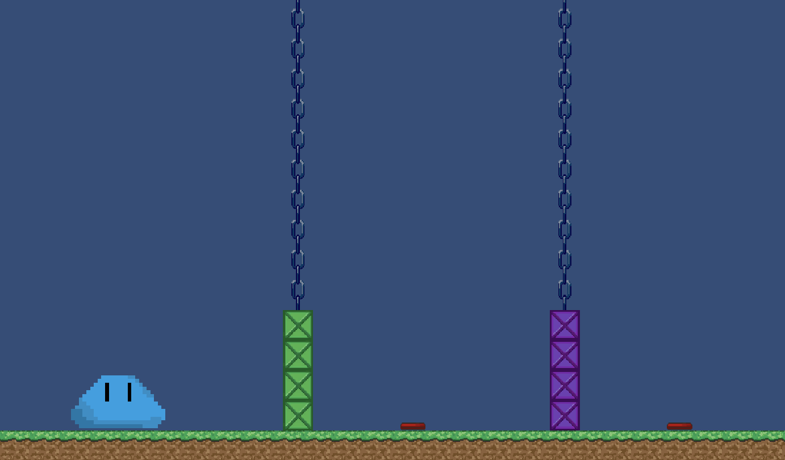
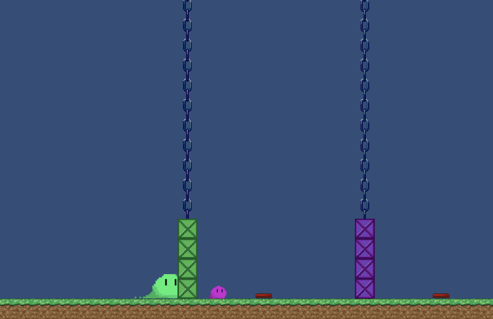

# PegJam2019
 Peg Jam is a local Game Jam in Winnipeg, this project was created during this project in a group of 4. [Members: Arvind Maan, Andy Tan, Aaron Salo, Caden Chabot]

The theme for this project was Parallel Worlds.
After much ideation, our idea was to create a platformer of a hero that exists in 3 worlds: the shared world, the green world and the purple world.

We decided on using the built in unity collaboration when creating this project, as opposed to using git. 

Below you can see our hero in the world.

This is the hero that exists simultaneously in BOTH worlds. In other words, all obstacles apply to him.

Below you can see the mechanic of splitting into the two worlds.

The green slime only runs into green obstacles. The purple slime only runs into the purple obstacles.

The game has 4 full fledged levels with different mechanics in each, a title and level select screen.
 
